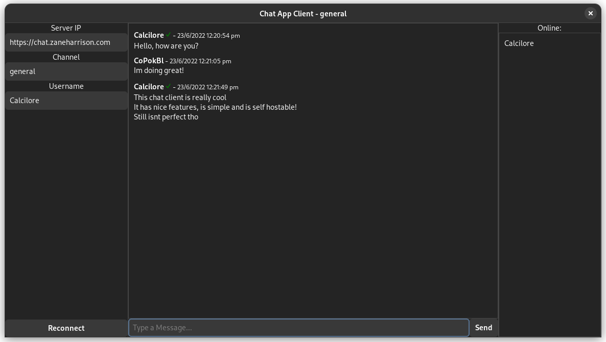

# A GTK Chat Client
## A simple GTK chat client for CoPokBl's Chat Server 

This is a simple client for CoPokBl's [chat server](https://github.com/CoPokBl/BasicChatApi). It is focused around simplicity and privacy, with no user accounts and a trusted user system this is designed to be simple and just be a chat client to talk with your friends. This can make an excellent alternative to chat platforms like Discord.

## How to install this client?

1. Go to the Releases Page
2. Download the latest version for your computer
3. Extract and run

If it doesnt open on windows you may need to install [the runtime for GTK](https://github.com/tschoonj/GTK-for-Windows-Runtime-Environment-Installer/releases)

## What purpose does this have?

This client is designed to be a simple and private chat client, with no accounts required and very little resource usage, it is ideal for people who just want a platform to chat with their friends.

## What features does this client have?

 - Self hostable
 - No account requirement
 - Privacy
 - Trusted users system with private and public keys to make sure people dont impersonate your friends!

## How do I use this client?

### How do I trust users

1. Right click on a message from the user you want to trust
2. Click "Add Trusted"
3. now all messages from that computer will have a checkmark!
